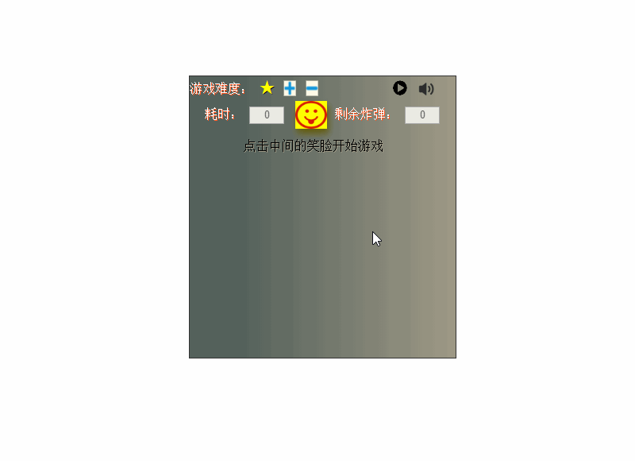

## 一款 web 扫雷游戏
***
### 效果展示如下：

## JS 逻辑
- 模块化 的JS
	- 分离出 背景音乐 地图数据 主逻辑三个模块
- 背景音乐
	- 绑定事件
	- 循环列表播放歌曲
- 地图数据
	- 生成 雷分布情况的数组
	- 生成 雷周围数字的数组
		- 为每个雷周围的每个方格加 1

## CSS 样式
- 文字阴影
	text-shadow: 1px 1px #FF5722;
- 游戏背景渐变
	background: -webkit-linear-gradient(0deg, #54615B 18%, #9E9986 99%);

- 动画
	- 初始化动画

			@-webkit-keyframes show{
				0%{
					transform:rotate(0);
				}
				100%{
					-webkit-transform:rotate(360deg);
				}
			}
			#ww-id-game_box{
				animation: show 1s;
				animation-timing-function: linear;
			}

## HTML5
- 语义化标签
nav article section
- audio 音频标签
